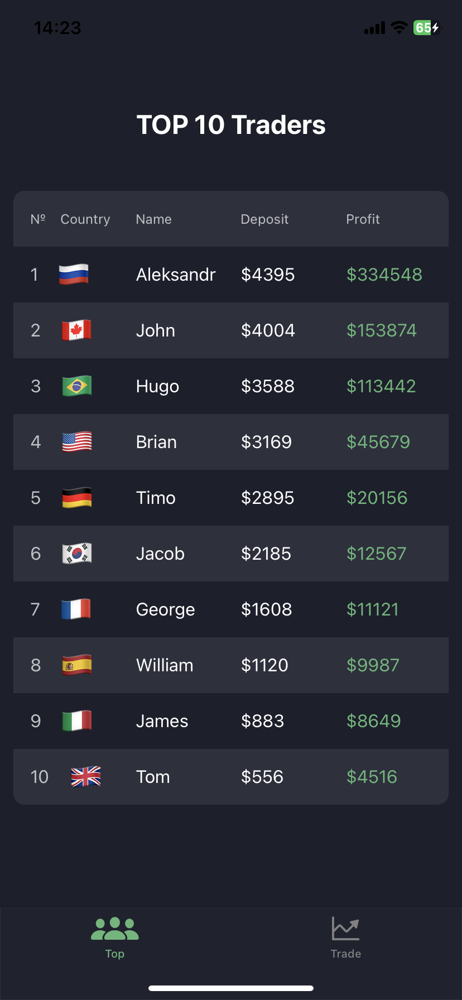

# TradeApptest

Это тестовое приложение с использованием WebKit от компании SLAVIT OÜ. [Figma](https://www.figma.com/file/SdiMizFRMUrYtTI5LIh2v4/HM-Тестовое-задание?type=design&node-id=0-1&t=REJzKzKMNCD9mUy4-0)

Возможности приложения:
- Приложение включает два экрана: Top traders, Trade;
- В Top traders обновляется таблица с данными через определенный промежуток времени;
- В Trade можно выбрать любую пару валют из списка и вывести график на экран, а также симуляция "купли-продажи".

  
  
  

